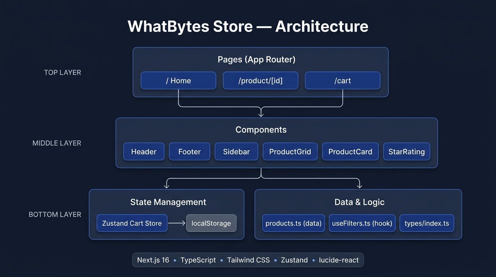

# WhatBytes Store

A modern e-commerce product listing application built as part of the WhatBytes Frontend Assignment.

## 🔗 Live Demo

> **[https://whatbyte-store.vercel.app](https://whatbytes-store-ten.vercel.app/)**


## ✨ Features

- **Product Listing** — Responsive grid (3-col desktop, 2-col tablet, 1-col mobile)
- **Sidebar Filters** — Category, price range slider, and brand filters
- **URL-Based Filtering** — Shareable filtered URLs (`?category=Electronics&maxPrice=500`)
- **Search** — Real-time string-matching search across title, description, and category
- **Product Detail Page** — Image, description, quantity selector, add to cart
- **Shopping Cart** — Quantity controls, remove items, price summary
- **Cart Persistence** — Cart state saved to `localStorage` via Zustand persist middleware
- **Empty States** — Friendly messages when no products match filters or cart is empty
- **Custom 404** — Branded not-found page

## 🛠 Tech Stack

| Layer | Technology |
|---|---|
| Framework | Next.js 16 (App Router) |
| Language | TypeScript |
| Styling | Tailwind CSS |
| State Management | Zustand (with localStorage persistence) |
| Icons | lucide-react |
| Font | Inter (Google Fonts) |
| Deployment | Vercel |

## 📂 Project Structure

```
whatbyte-store/
├── app/
│   ├── layout.tsx           # Root layout with Header + Footer
│   ├── page.tsx             # Home page (/)
│   ├── not-found.tsx        # Custom 404 page
│   ├── product/[id]/
│   │   └── page.tsx         # Product Detail (/product/[id])
│   └── cart/
│       └── page.tsx         # Cart Page (/cart)
├── components/
│   ├── layout/
│   │   ├── Header.tsx       # Logo, Search, Cart badge
│   │   └── Footer.tsx       # Links, social icons, copyright
│   ├── home/
│   │   ├── Sidebar.tsx      # Category, price, brand filters
│   │   └── ProductGrid.tsx  # Responsive product grid + empty state
│   ├── product/
│   │   └── ProductCard.tsx  # Card with image, title, price, add-to-cart
│   └── ui/
│       └── StarRating.tsx   # Reusable star rating component
├── data/
│   └── products.ts          # Static product data (10 products)
├── hooks/
│   └── useFilters.ts        # URL-driven filter logic
├── store/
│   └── cartStore.ts         # Zustand cart store
└── types/
    └── index.ts             # TypeScript interfaces
```

## 🏗 Architecture



## 🚀 Getting Started

```bash
git clone https://github.com/nilaygit-10721/whatbytes-store.git
cd whatbyte-store
npm install
npm run dev
```

Open [http://localhost:3000](http://localhost:3000) in your browser.

---

Built with Next.js 16 + Tailwind CSS + Zustand.

